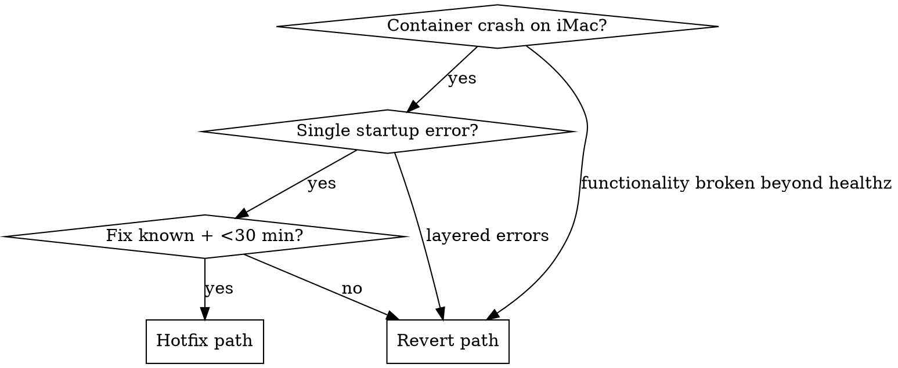

# Runbook — Revert a broken merge on `develop`

**Use this when:** a squash-merge to `develop` landed code that
crash-loops on deploy (iMac) or fails integration checks that CI
missed. The goal is to restore a working production state **fast**
and defer the redesign to a fresh slice.

**Do not use this for:** simple bug fixes. If a hotfix on a feature
branch can land in <30 min with CI green, prefer that over a revert.

**Grounded in:** GIM-48 incident (2026-04-18). See
`docs/postmortems/2026-04-18-GIM-48-n1a-broken-merge.md`.

## Decision tree



**Rule of thumb:** if you fix one crash and a second crash appears
underneath, stop and revert. Layered runtime errors signal a deeper
design flaw (as in GIM-48: import path → cache perms → cross_encoder
→ nonexistent API). Keep layering only if the next error is
predictable and the total fix is still small.

## Step 1 — Diagnose on iMac

```bash
ssh anton@imac-ssh.ant013.work
cd /Users/Shared/Ios/Gimle-Palace

docker compose --profile full ps
docker compose --profile full logs --tail=100 palace-mcp | tail -50
curl -s "http://localhost:${PALACE_MCP_HOST_PORT:-18080}/healthz"
```

Capture the traceback verbatim. If the container is stuck in
`Restarting (...)`, the error is in startup; `/healthz` is irrelevant.

Pull the traceback into your notes — you'll reference file:line in
both the hotfix attempt and (if needed) the revert commit message.

## Step 2 — Hotfix attempt (bounded)

Budget: one hour, one push. If you're past that, revert.

```bash
# Local (not iMac)
cd /path/to/Gimle-Palace
git fetch origin
git checkout develop
git pull --ff-only
git checkout -b hotfix/GIM-<N>-<short-description>
# ... patch ...
# Verify locally:
cd services/palace-mcp
uv run ruff check
uv run ruff format --check
uv run mypy src/
uv run pytest
# Push + PR:
git push -u origin hotfix/GIM-<N>-<short-description>
gh pr create --base develop --head hotfix/... --title "fix(...): ..."
```

If CI goes green on the PR and a fast squash-merge is available
(`mergeStateStatus: CLEAN`), merge non-admin and redeploy to iMac:

```bash
gh pr merge <N> --squash --delete-branch
# Then on iMac:
git fetch origin && git checkout develop && git pull --ff-only
docker compose --profile full down
docker compose --profile full build --no-cache palace-mcp
docker compose --profile full up -d
curl -s "http://localhost:${PALACE_MCP_HOST_PORT:-18080}/healthz"   # expect 200 ok
```

**After rebuild:** do a real functional check, not just `/healthz`.
Call one real MCP tool (e.g. `palace.memory.health()` with counts)
or run the ingest CLI once. `/healthz` was the false-positive signal
in GIM-48 and will lie again.

If the functional check surfaces a new error → revert. Do not stack
a third round of layered hotfixes.

## Step 3 — Revert decision

Revert if any of:

- Layered errors keep appearing after each hotfix.
- The broken merge references APIs that don't exist in the installed
  library version.
- Unit tests were entirely mock-based and bypass the failure path.
- CI was already red at the time of the original merge (you're
  inheriting multiple failures).

Write the decision in a comment on the paperclip issue before
acting:

```
Reverting <merge SHA> on develop. Reasons:
1. <specific — not "it's broken">
2. <specific>
Replacement slice: will draft as GIM-<NEXT> after revert.
```

## Step 4 — Create the revert branch

Always revert **from main on your local**, not iMac. iMac's checkout
is for deploys, not authoring.

```bash
cd /path/to/Gimle-Palace
git fetch origin
git checkout develop
git pull --ff-only
git checkout -b rollback/revert-GIM-<N>

# Revert in reverse chronological order. If a hotfix sits on top of
# the broken merge, revert both in one commit:
git revert --no-commit <hotfix-sha> <broken-merge-sha>

# Single commit with a full explanation:
git commit -m "revert: roll back GIM-<N> <short-description>

<explain WHY — what's broken, which gates failed, what downstream fix is queued>
"
```

## Step 5 — Push + PR

```bash
git push -u origin rollback/revert-GIM-<N>
gh pr create --base develop --head rollback/revert-GIM-<N> \
  --title "revert: roll back GIM-<N> <description>" \
  --body "$(cat <<'EOF'
## Why
<diagnosis summary>

## Changes reverted
- <hotfix SHA> (obsolete after revert)
- <broken-merge SHA>

## Post-revert test plan
- [ ] Local: ruff/mypy/pytest green
- [ ] iMac: rebuild, functional check (not just /healthz)
- [ ] Replacement slice GIM-<NEXT> drafted on main

## Pre-existing CI failures (if any)
<cite which checks were already red before this revert>
EOF
)"
```

## Step 6 — Merge

If CI is **already red on `develop`** because of the broken merge, the
revert PR itself will also show red inherited checks. In that
specific case, admin-override is acceptable — document the reason in
the merge body. This is the **only** legitimate admin-override case
(see `CLAUDE.md`).

```bash
gh pr merge <PR#> --squash --delete-branch --admin \
  --subject "revert: roll back GIM-<N> ..." \
  --body "Admin override because CI inherited failures from the broken merge being reverted; revert itself restores green."
```

For a hotfix-only revert (CI was green before), merge non-admin:

```bash
gh pr merge <PR#> --squash --delete-branch
```

## Step 7 — iMac redeploy

```bash
ssh anton@imac-ssh.ant013.work
cd /Users/Shared/Ios/Gimle-Palace
git fetch origin
git checkout develop
git pull --ff-only

docker compose --profile full down
docker compose --profile full build --no-cache palace-mcp
docker compose --profile full up -d

# Allow startup
sleep 30
docker compose --profile full ps
curl -s "http://localhost:${PALACE_MCP_HOST_PORT:-18080}/healthz"
```

Then the **functional check** (not just healthz):

```bash
# Real MCP call via SSH tunnel from a machine with MCP client:
# palace.memory.health()   → live counts
# palace.memory.lookup(entity_type="Issue", limit=5)  → non-empty
```

After deploy, checkout the iMac back to `develop` if it isn't
already — see `feedback_imac_checkout_discipline.md` in operator
auto-memory.

## Step 8 — Postmortem + replacement slice

Within the same session if possible:

1. **Postmortem** — new file
   `docs/postmortems/YYYY-MM-DD-GIM-<N>-<slug>.md` using the GIM-48
   template: what happened, which gates failed (CI / QA / mocks /
   verification), process changes applied, process changes queued.

2. **Memory update** — if a new pitfall surfaced (library API
   mismatch, deploy step, endpoint quirk), add a reference-type
   memory file under `~/.claude/projects/.../memory/` and link from
   `MEMORY.md`.

3. **Replacement slice (if applicable)** — draft a new spec + plan
   for the intended work, rebuilt on verified primitives. Reference
   the postmortem as motivation. Open as a fresh paperclip issue.

## Don'ts

- Don't skip Step 7 functional check. `/healthz` only proves
  connectivity.
- Don't reuse the old issue ID for the replacement slice — open a
  new issue.
- Don't delete specs/plans from the reverted slice. Add a
  deprecation banner at the top pointing to the replacement; keep
  them as history.
- Don't extend the hotfix attempt past one push worth of fixes.
  Layered errors mean "revert", not "keep layering".

## Related

- `docs/postmortems/2026-04-18-GIM-48-n1a-broken-merge.md` — concrete
  instance of this runbook in action.
- `CLAUDE.md` — admin-override policy.
- `phase-handoff.md` (shared-fragment) — why the gates exist.
- `reference_paperclip_stale_execution_lock.md` — related paperclip
  bug that may surface during revert workflow.
